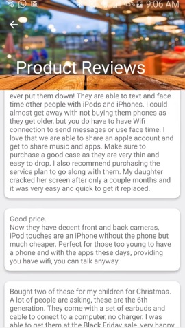

# **HP Hackathon**
#### PAY - Product Comparison App

---

#### Overview

- App allowing users to take a picture of a product's barcode and immediately search & compare product prices and user reviews across Walmart's and Ebay's databases.  This is achieved through HP's Barcode Recognition API, which returns the product's UPC code for analysis.  By interfacing with Walmart's and Ebay's API's, the app can use the UPC code to pull relevant product prices and user reviews for display.
- The user reviews are analyzed using HP's text sentiment analysis and will display in a lighter green color if the user reviews are positive, and in a dark red color if they are negative
- By leveraging the Google Places API, the app is then able to locate the nearest location for a customer to purchase the product under review

#### Key Technologies Leveraged

- HPE Barcode Recognition
- HPE Sentiment Analysis
- HPE Text Autocomplete
- Walmart Product Retrieval API
- Walmart Customer Review API
- Ebay Product Retrieval API
- Google Places API
